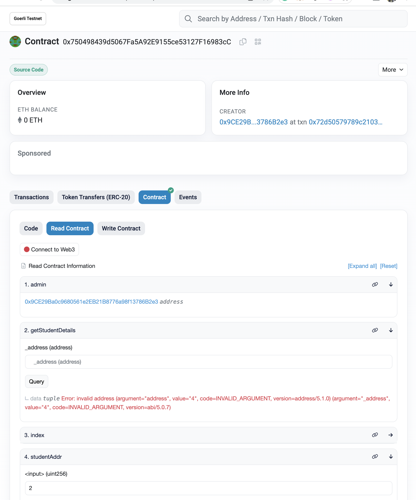

# Student's Data Registration

## Web3Bridge Assignment

### Contents
- Introduction
- Screenshots
- Languages
- Functions

### Introduction
This project works on the process of registering students to the blockchain. It gives designated admin the ability to makes use on struct to collate students details assigning a unique ID to students in the process. Students details are made public and can be accessed with each students address. No address can register twice, hence eliminating double registration.

### Screenshots
#### Interacting with verified contract on etherscan

### Languages
- Solidity
- TypeScript

### Function Interactions
- registerStudent Function
- getStudent Function
- deleteStudent Function
- changeAdmin Function
